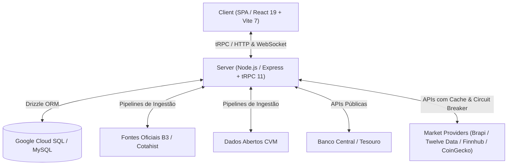

# 🏛️ Virtus Portal — Inteligência e Dados Financeiros

> **Portal de investimentos brasileiro com dados oficiais B3/CVM, cotações em tempo real, análise fundamentalista, simulador de carteira e cobertura macroeconômica.**

[](https://www.typescriptlang.org/)
[](https://react.dev/)
[](https://tailwindcss.com/)
[](https://orm.drizzle.team/)
[](LICENSE)

---

## 📌 Visão Geral

O **Virtus Portal** é uma plataforma analítica desenvolvida para investidores do mercado brasileiro. A aplicação combina dados auditáveis de fontes oficiais governamentais e regulatórias (**B3**, **CVM**, **Banco Central**, **Tesouro Nacional**) com agregadores globais de cotações de alta frequência, provendo uma experiência completa de monitoramento, análise e gestão de patrimônio.

---

## ✨ Funcionalidades Principais

### 📊 Mercados & Cotações
- **Painel de Índices B3**: Ibovespa, IFIX, IDIV, SMLL, IBrX-100 e composição oficial.
- **Macroeconômico**: Acompanhamento dinâmico de Selic, CDI, IPCA e taxas de câmbio (USD/BRL, EUR/BRL).
- **Renda Fixa & Tesouro Direto**: Taxas e vencimentos de títulos públicos oficiais.
- **Criptoativos & Câmbio Global**: Monitoramento integrado via provedores globais autorizados.
- **Transmissão em Tempo Real**: Atualizações via WebSocket com fallback resiliente para polling inteligente.

### 🔍 Análise Fundamentalista & Screener
- **Demonstrações CVM**: Balanço Patrimonial, DRE e DFC históricos ingeridos diretamente dos dados abertos da CVM.
- **Screener Avançado**: Filtros por P/L, P/VP, Dividend Yield, ROE, Margem Líquida, Dívida Líquida/EBITDA e EV/EBITDA.
- **Comparador Multiativos**: Comparação lado a lado de múltiplos indicadores e histórico de preços.

### 💼 Gestão de Carteira & Ferramentas
- **Simulador e Consolidador de Carteira**: Alocação por classe de ativos, rentabilidade histórica e controle de aportes.
- **Calculadoras Financeiras**:
  - Juros Compostos & Projeção Patrimonial
  - Preço-Teto (Método Graham e Método Décio Bazin)
  - Reserva de Emergência e Liberdade Financeira
- **Alertas de Mercado**: Notificações configuráveis de preços e limites por e-mail.

### 📰 Notícias & Editorial
- **Fatos Relevantes CVM & Agregador Oficial**: Notícias do mercado corporativo e comunicados oficiais.
- **Esteira Editorial com Revisão Humana**: Pipeline assistido por IA com curadoria e aprovação de publicações.
- **Guia Educacional**: Módulos interativos de aprendizado sobre finanças e investimentos.

### 🛡️ Transparência & Privacidade (LGPD)
- **Painel de Proveniência de Dados**: Identificação clara da fonte e nível de delay de cada dado.
- **Governança de Cookies & Consentimento**: Gestão auditável de consentimento em conformidade com a LGPD.

---

## 🏗️ Arquitetura

O projeto adota uma arquitetura **monorepo modular** com TypeScript ponta a ponta:



### Estrutura de Diretórios

```
virtus-portal/
├── client/                 # Frontend SPA (React 19, TailwindCSS v4, wouter, TanStack Query)
│   ├── src/
│   │   ├── _core/          # Hooks de infraestrutura e autenticação
│   │   ├── components/     # Componentes de UI (Radix, gráficos Recharts, modais)
│   │   ├── contexts/       # Contextos React (Tema, filtros)
│   │   ├── lib/            # Utilitários de analytics, métricas e helpers
│   │   └── pages/          # Páginas e rotas da aplicação
├── server/                 # Backend API (Express, tRPC 11, WebSockets)
│   ├── _core/              # Configuração do servidor, contexto e handlers tRPC
│   ├── routers/            # Routers tRPC modulares (auth, market, portfolio, editorial, etc.)
│   ├── db.ts               # Conexão Drizzle ORM e queries de banco
│   ├── marketProviders.ts  # Adaptadores e circuit breakers de provedores externos
│   └── *.test.ts           # Testes unitários e de integração
├── shared/                 # Tipos, esquemas e constantes compartilhados
├── drizzle/                # Esquemas, migrações SQL e histórico do Drizzle ORM
├── scripts/                # Scripts operacionais (ingestão CVM/B3, seed, smoke tests, schedulers)
├── docs/                   # Documentação detalhada
│   ├── architecture/       # Architecture Decision Records (ADRs 001 a 009)
│   ├── audits/             # Relatórios históricos de auditoria de qualidade e produto
│   ├── operations/         # Guias de operação, segurança e métricas
│   └── progress/           # Registros de evolução por ondas de entrega
├── e2e/                    # Testes ponta a ponta (Playwright + Axe Acessibilidade)
└── cloudbuild.yaml         # Pipeline CI/CD automatizada para Google Cloud Run
```

---

## 🛠️ Stack Tecnológica

| Camada | Tecnologia |
|---|---|
| **Frontend** | React 19, Vite 7, TypeScript 5.9, TailwindCSS 4, Radix UI, Lucide Icons, Recharts |
| **Roteamento & Estado** | Wouter, TanStack Query (React Query v5), Context API |
| **Backend** | Node.js, Express, tRPC 11, ws (WebSocket) |
| **Banco de Dados** | Google Cloud SQL (MySQL), Drizzle ORM, Drizzle Kit |
| **Autenticação** | Firebase Authentication + JWT |
| **Comunicação / E-mail** | Resend API |
| **Testes** | Vitest, Playwright (E2E), @axe-core/playwright (Acessibilidade WCAG) |
| **Infraestrutura / Deploy** | Google Cloud Build, Google Cloud Run, Firebase Hosting |

---

## 🚀 Como Executar Localmente

### Pré-requisitos
- **Node.js**: `v20.x` ou superior
- **pnpm**: `v10.x` ou superior
- **MySQL** (opcional para desenvolvimento com banco local, ou apontamento para Cloud SQL)

### 1. Clonar o Repositório
```bash
git clone https://github.com/joaoschaun33-cloud/virtus-invest-portal.git
cd virtus-invest-portal
```

### 2. Instalar Dependências
```bash
pnpm install
```

### 3. Configurar Variáveis de Ambiente
Copie o modelo de variáveis de ambiente e preencha conforme necessário:
```bash
cp .env.example .env
```

> **Nota:** As chaves de provedores pagos são opcionais para desenvolvimento básico da interface.

### 4. Executar o Servidor de Desenvolvimento
```bash
pnpm dev
```
Acesse a aplicação em `http://localhost:5000` (ou porta informada no terminal).

---

## 📦 Scripts Disponíveis

| Comando | Descrição |
|---|---|
| `pnpm dev` | Inicia o servidor full-stack em modo de desenvolvimento com hot-reload |
| `pnpm build` | Gera o bundle otimizado de produção (Vite + esbuild) |
| `pnpm start` | Inicia o servidor compilado em modo de produção |
| `pnpm check` | Executa a checagem de tipos estáticos do TypeScript (`tsc --noEmit`) |
| `pnpm format` | Formata o código-fonte com Prettier |
| `pnpm test` | Executa a suíte completa de testes unitários com Vitest |
| `pnpm test:e2e` | Executa os testes ponta a ponta com Playwright |
| `pnpm test:load` | Executa teste de carga/smoke test na API |
| `pnpm test:official-sources` | Valida a conectividade com fontes oficiais (B3, CVM, Tesouro) |
| `pnpm db:push` | Gera e aplica migrações de banco com Drizzle Kit |
| `pnpm seed:b3-indexes` | Executa o seed das composições de índices B3 |
| `pnpm ingest:cvm-financials` | Dispara a ingestão de demonstrativos financeiros da CVM |
| `pnpm ingest:b3-cotahist` | Processa os arquivos históricos do B3 Cotahist |

---

## 🧪 Testes & Qualidade

```bash
# Testes Unitários e de Integração
pnpm test

# Testes End-to-End e Acessibilidade
pnpm test:e2e

# Validação estática de tipos
pnpm check
```

---

## 📐 Decisões Arquiteturais (ADRs)

As decisões estruturais do portal estão documentadas em [`docs/architecture/`](docs/architecture/):

- [ADR-001: Governança de Fontes de Dados](docs/architecture/adr-001-data-source-governance.md)
- [ADR-002: Ingestão Oficial de Dados de Mercado](docs/architecture/adr-002-official-data-ingestion.md)
- [ADR-003: Referencial de Emissores B3](docs/architecture/adr-003-b3-issuer-reference.md)
- [ADR-004: Demonstrativos Financeiros CVM](docs/architecture/adr-004-cvm-financial-statements.md)
- [ADR-005: Métricas Financeiras Derivadas](docs/architecture/adr-005-derived-financial-metrics.md)
- [ADR-006: Histórico Trimestral CVM](docs/architecture/adr-006-cvm-quarterly-history.md)
- [ADR-007: Agendamento de Ingestões CVM](docs/architecture/adr-007-scheduled-cvm-ingestion.md)
- [ADR-008: Integração CoinGecko e EODHD](docs/architecture/adr-008-coingecko-eodhd-integration.md)
- [ADR-009: Fontes Oficiais do Painel Editorial](docs/architecture/adr-009-official-editorial-sources.md)

---

## 🚢 Deploy & Integração Contínua

O deploy de produção é acionado via **Google Cloud Build** ([`cloudbuild.yaml`](cloudbuild.yaml)):
1. Build da imagem Docker da aplicação e do container de migração.
2. Execução do Cloud Run Job de migração (`virtus-migrate`) com Cloud SQL.
3. Deploy da nova revisão no **Google Cloud Run** (`virtus-web`) na região `southamerica-east1`.
4. Segredos gerenciados via **Google Secret Manager**.

---

## 📄 Licença

Software proprietário. Todos os direitos reservados a Virtus Investimentos — consulte [LICENSE](LICENSE). O código-fonte não é aberto e seu uso, cópia ou distribuição sem autorização por escrito não são permitidos.
